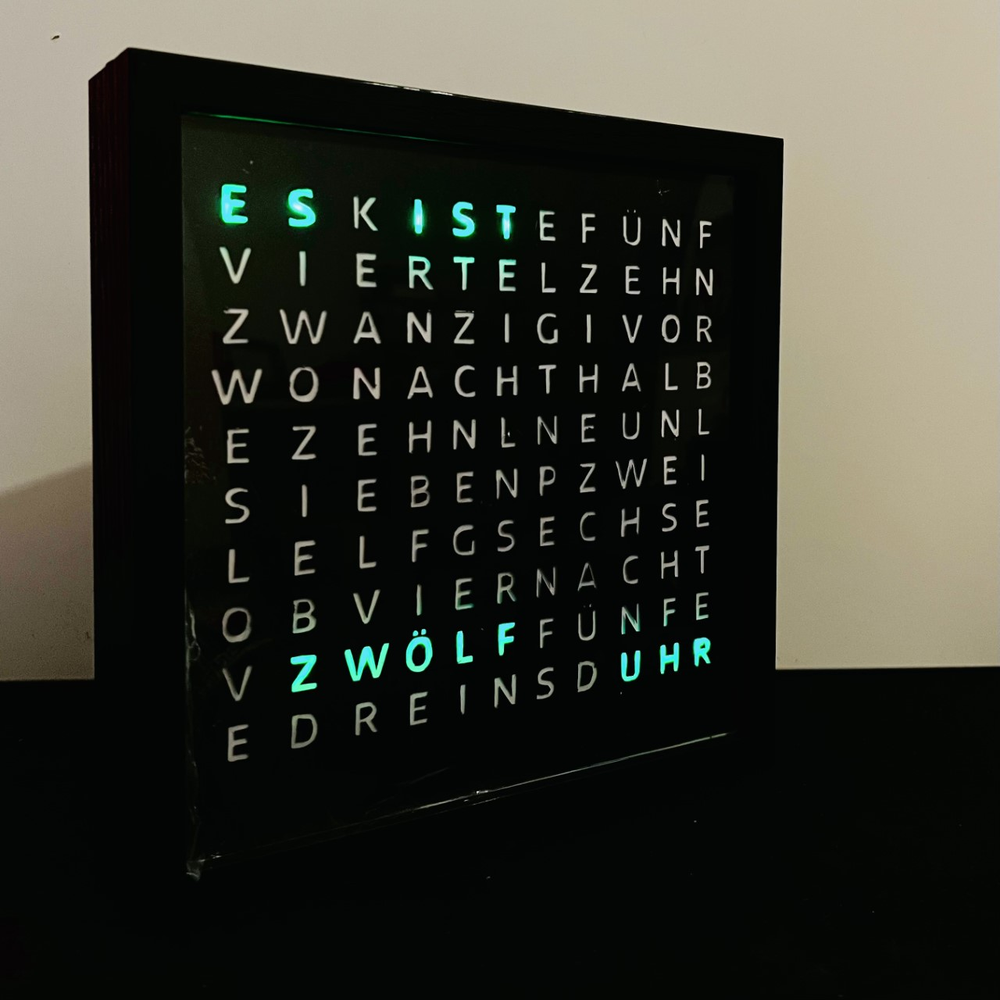

# German_text_clock
This is a hardware+software project made as a gift to a friend. 

## Introduction
this is a fun project that is a combination of a novel way to display time and packaging it robustly to make it function as a desk clock.

## Skills required  
Hardware: 
1. dot board / PCB creation.  
2. Multiplexing digital pins.  
3. Hardware Architecture.  
4. soldering.  

Firmware/Software
1. Serial communication  
2. I2C communication  
3. RTC  
4. EEPROM usage on the RTC.  
5. intermediate C/C++ programming skills.
 
## Hardware
This is a project involving developing code that is intended to run on an embedded target. 
Additionally, the interfaces and peripherals were designed and integrated to function together with the software. 
The target here is an Arduino Nano every. 
This board package is chosen so that it can be easily packaged as well as serves as a power supply to the clock.

Requires 
Hardware
- 1 x Arduino Nano Every
- 1 x DS3231 real time clock
- 1 x cr2032 coin cell battery
- 1 x 74HC4067 16 channel analog/digital multiplexer
- 1 x 15x20 cm single side dot board 
- 100 x green(recommended) diffused LEDs. It is not recommended to use clear LEDs as they are too bright for this project!
- 30 x 1k Ohm resistors 
- 10 x 330 ohm resistors
- [loose components](https://amzn.eu/d/htS7Kq4)
- some wires and a soldering kit.

Housing
- 20cmx20cm picture frame with a 3cm depth for packaging : [link](https://amzn.eu/d/8aUODaw)

## Steps:
1. Preparing the Display.
2. Preparing the connector board.
3. Preparing the main controller board.
4. Packaging the clock.
5. Coding. 
5. set the clock using a windows application > link!

### Preparing the Display
The Display is the corner stone of this project. 
There were a lot of challenges along the way to make it work so as to be pleasing to the eye.  

1. using the template in doc, take a print of the sheet in A4 paper without changing the borders while printing.   
2. paste the sheet on a black A4 chart. black offers the best contrast to any of the colors of the LED that would be chosen.  
  
3. using an exactor knife carve the letters out so that later on, light can illuminate the carved out letter.  
4. once it is complete. carefully paste it onto the glass of the picture frame on the inside.  
5. LEDs work best when they are diffused further to display. hence a diffuser sheet is cut to the size of the frame and pasted over the 
   already pasted letters  
6. Later you may need to add more layers depending on the LED brightness.
7. A 17x17 cm dot board was used to align the LEDs as shown in the configuration below
  

8. Under the sheet of letters, it should align as shown below  

9. The display will need atleast 23 output ports on a microcontroller to drive it. This will be dealt in the next section.
10. choice of current limiting resistors are left as an exercise for the reader since it depends on the aesthetics of the constructed product.  

### Preparing the hardware
The Hardware has to drive 22 sets of LEDs. This is not possible directly by the Nano Every 
because 4 pins are used for I2C and Serial Communication.

Solution was to use a 16 channel multiplexer to drive 10 LED units that are switched on mutually exclusively.
Thus, the words two (Zwei) and from four(Vier) to twelve(Zwoelf) are driven by the multiplexer.
this reduces the pin requirement from 23 to 17. 

### ToDo : Algorithm to maintain DST

### ToDo : Algorithm to set the time via Serial comms

